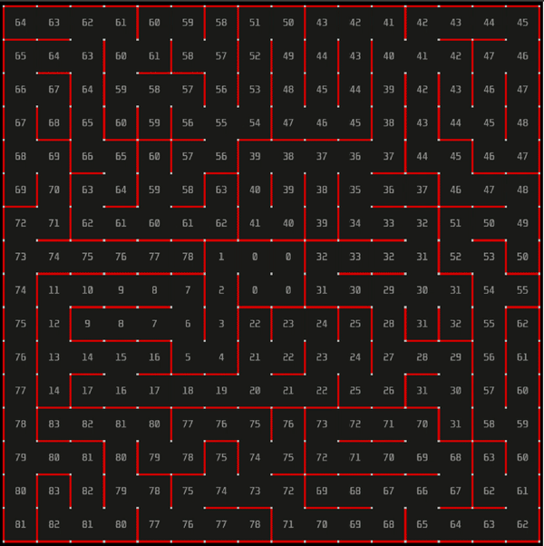
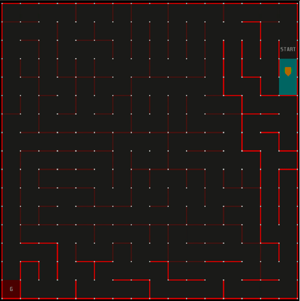

# Maze-Solver-simulation-using-Wall-Following-Algorithm-OOP
Implementation of the "wall following" algorithm using OOP

Code repo linked [here](https://github.com/darshit-desai/Maze-Solver-simulation-using-Wall-Following-Algorithm-OOP), and code documentation linked [here](https://darshit-desai.github.io/Maze-Solver-simulation-using-Wall-Following-Algorithm-OOP/)

A micro mouse solver using left and right wall follower algorithms implemented using C++

A micro mouse to reach a final destination in a maze using Left and Right Wall Follower Algorithm. The project is implemented using C++ and micromouse Simulator. The algorithm designed works on large variety of mazes designed in the Simulator efficiently. The algorithm is designed using Object Oriented Approach in C++ implementing the concepts of encapsulation and abstraction. The mouse reaches back to origin from final destination by keeping track of its forward path and reaching in shortest distance possible.

How To Run?
1. Install Simulator Environment on your system. Please refer to https://github.com/mackorone/mms (Credits to Mack for Simulator Software) for Installation of the Simulator.
2. Give the relative path in Simulator of the application folder including all sub program files designed for various functionalities.
3. Click on Run in the Simulator Environment to see the mouse moving along the path.
4. The algorithm can be tested on different mazes present in mazefiles folder.

The output of the Wall following algorithm from position (0,0) to randomly generated goal looks like the following:

The project had bonus points for re tracing the path followed by the robot without using Wall following algorithm and avoiding dead ends at the same time, (Using only the path stored during forward motion), We were able to score full bonus points for that too and the output is as below:

Contributors: [Darshit Desai](https://github.com/darshit-desai) , [Vinay Krishna Bukka](https://github.com/vinay06vinay), Vamshi Kalavagunta

